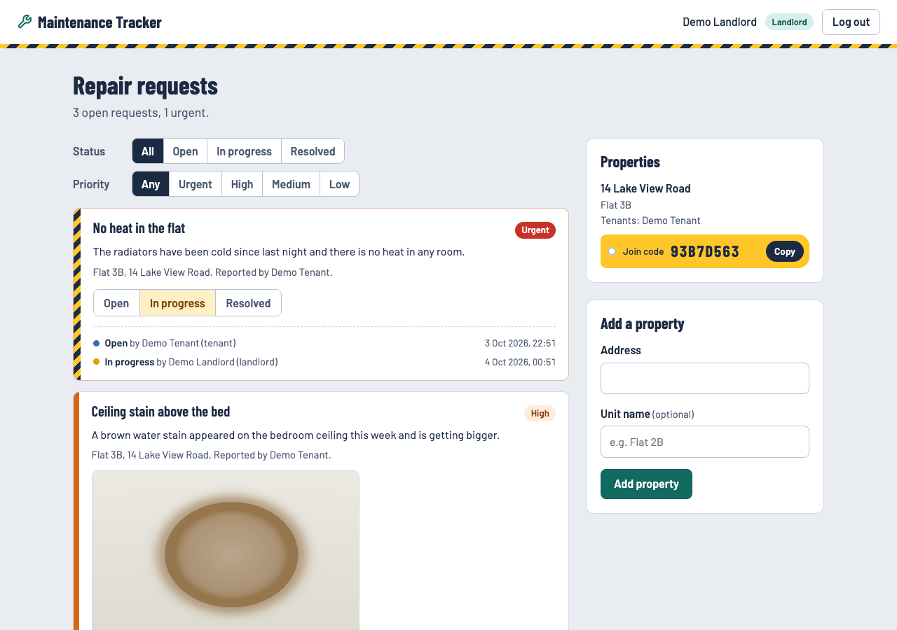
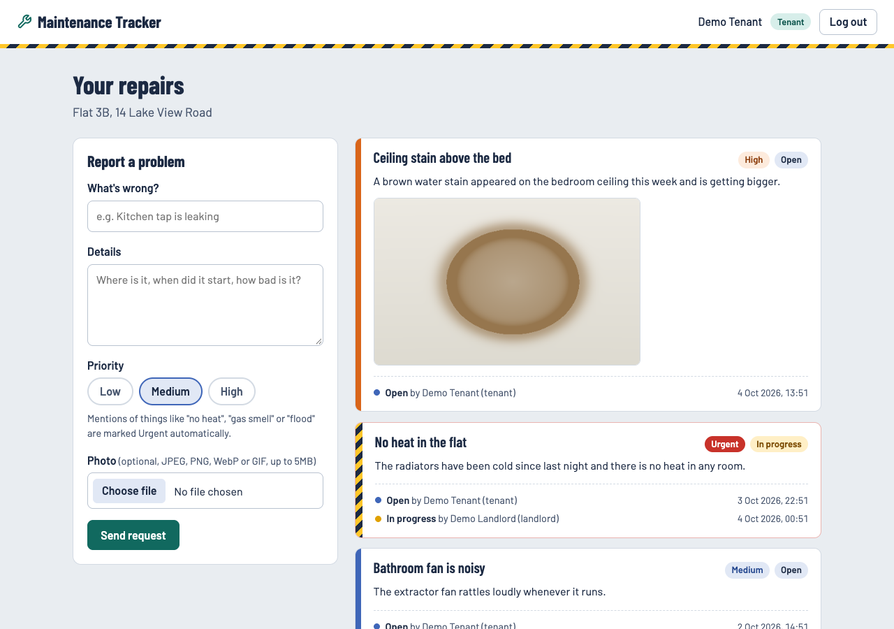
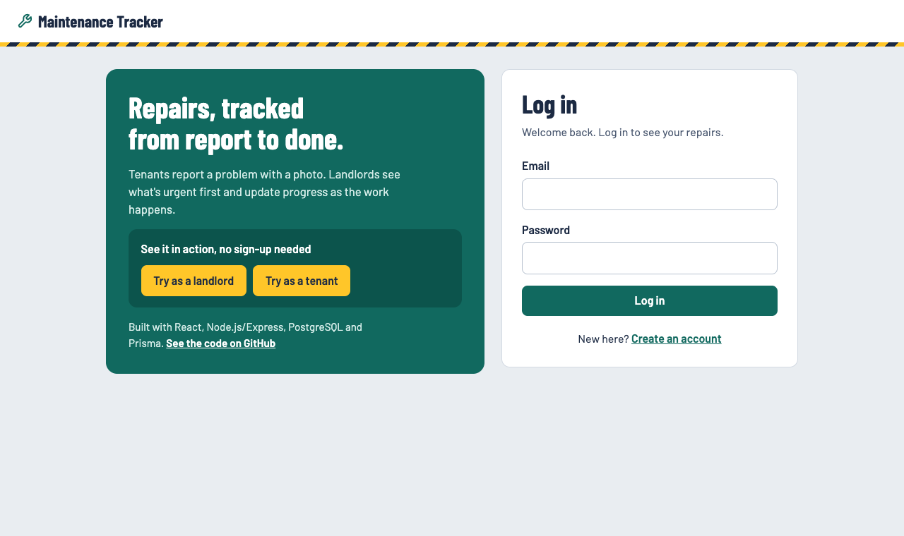
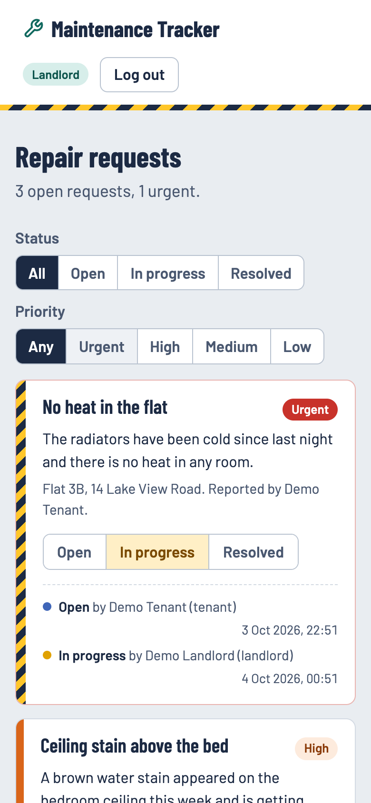
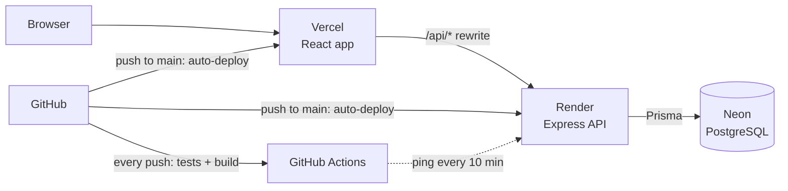

# Landlord/Tenant Maintenance Tracker

[](https://github.com/Seshasai-Tunuguntla/landlord-maintenance-tracker/actions/workflows/ci.yml)

Tenants report repair problems with a photo; landlords see what's urgent first and move each request from **Open → In progress → Resolved**, with a full history of who changed what and when.

**Live demo:** https://landlord-maintenance-tracker.vercel.app. Click **Try as a landlord** or **Try as a tenant** on the login page; no sign-up needed. Demo data resets itself, so feel free to click around.



| Tenant view | Login with one-click demo | Phone |
|---|---|---|
|  |  |  |

## Features

- **Two roles.** Landlords add properties and get a join code; tenants join with that code.
- **Repair requests with photos.** JPEG, PNG, WebP or GIF, up to 5 MB.
- **Automatic urgency.** Mentions like "no heat", "gas smell" or "flood" mark a request Urgent whatever priority the tenant picked, and urgent requests sort to the top.
- **Status workflow with an audit trail.** Every change records the status, who made it and when.
- **Landlord filters.** By status and priority, with server-side paging.
- **Public demo** that protects itself from visitors (see design decisions).

**Stack:** React (Vite) · Node.js / Express 5 · PostgreSQL · Prisma · Zod · JWT + bcrypt · Jest + Supertest · GitHub Actions · Vercel · Render · Neon

## Architecture



The browser only ever talks to the Vercel domain: Vercel forwards `/api/*` to the API on Render, which is the only thing that touches the database. Every request goes **website → API (checks login, role, ownership, input) → database → API → website**.

```
client/   React app (Vite): pages, components, API client
server/   Express API: routes, middleware, Zod schemas, Prisma schema + migrations, demo reset, tests
.github/  CI (tests + client build) and the keep-awake ping
```

## Design decisions

- **PostgreSQL + Prisma instead of MongoDB.** The data is relational (users, properties, requests, status history, photos), and foreign keys let the database itself reject impossible states, like a request on a property that doesn't exist. Schema changes go through versioned migrations that run on every deploy.
- **Authorization in every handler, not just roles.** `requireRole('LANDLORD')` says *who* may call an endpoint; each handler also checks *ownership* (this landlord owns this property, this tenant filed this request). Tests cover one landlord trying to change another landlord's request.
- **Status rules live on the server.** Repeating the current status is rejected with a `409`, using a conditional update (`WHERE status <> new`) so two simultaneous clicks can't both write history. Reopening a resolved request is **allowed on purpose**: repairs come back, and the history shows it.
- **Simple keyword urgency.** It's predictable and easy to explain. The known limitation is that it has no context: "there is *no* gas smell" would still be flagged. That is the trade-off for something a landlord can trust and understand.
- **Photos in Postgres, not on disk.** Render's free disk is wiped on every restart, so files would vanish. Photos are served from `/api/photos/:id` under a random UUID and limited to raster formats (SVG can carry scripts). In production I'd move them to object storage (S3 or Cloudinary) to keep the database small.
- **Filtering and paging on the server.** The list endpoint takes `status`, `priority`, `page` and `pageSize`. The landlord's "3 open, 1 urgent" headline is a separate count that ignores filters, so it stays correct while filtering.
- **A demo that protects itself.** The demo accounts are public, so visitors can change anything. Demo data is rebuilt from a script when the server starts, and whenever a demo account logs in more than 30 minutes after the last reset, so each new visitor gets a clean demo without wiping someone mid-session. The demo tenant can't join other properties, and nobody can join the demo property.
- **Keeping the free API awake.** Render's free plan sleeps after ~15 idle minutes and takes up to a minute to wake. A scheduled GitHub Action pings it every 10 minutes, and the UI shows a "waking up" message in case it ever sleeps.

### Known trade-offs I'd address next

- **The JWT is stored in `localStorage`.** That's simpler than cookies, but any successful XSS could read it. React escapes output and the app never injects raw HTML, which lowers the risk. The stronger fix is an `httpOnly`, `SameSite` cookie, plus CSRF protection.
- **The join endpoint isn't rate-limited.** Join codes are 8 hex characters (about 4.3 billion combinations) and joining requires being logged in, so guessing is impractical. A per-user rate limit would still be cheap insurance.
- **One property per tenant.** That fits renters; supporting several would change the tenant dashboard and the join flow.

## Security and validation

- Passwords hashed with bcrypt; JWT auth with a 7-day expiry.
- Every request body and query is validated with [Zod](https://zod.dev) (`server/src/validation/schemas.js`), so bad input gets a `400` with a clear message.
- `helmet` security headers, CORS limited to the origins in `CLIENT_ORIGIN`, and rate limiting on login/register (20 requests / 15 min per IP).

## Testing

```
cd server
npm test
```

48 tests run against a separate `landlord_maintenance_test` database (create it once with `createdb landlord_maintenance_test`; `pretest` applies migrations automatically):
- `tests/priority.test.js`: urgent-keyword detection
- `tests/auth.test.js`: register, login and token validation
- `tests/requests.test.js`: join flow, role and ownership checks, urgency override, status history and rules, filters and paging, photo storage and file-type checks
- `tests/demo.test.js`: demo reset (undoes visitor changes, never touches real users) and the demo join restrictions

GitHub Actions (`.github/workflows/ci.yml`) runs the same tests against a throwaway Postgres, and lints and builds the client, on every push and pull request.

## Running locally

1. Make sure PostgreSQL is running (`pg_isready`) and the `landlord_maintenance` database exists.
2. API:
   ```
   cd server
   npm install
   npx prisma migrate dev
   npm run dev        # http://localhost:4000, also builds the demo accounts
   ```
3. Website (separate terminal):
   ```
   cd client
   npm install
   npm run dev        # http://localhost:5173, proxies /api to port 4000
   ```

`npm run demo:reset` (in `server/`) rebuilds the demo data by hand.

### Environment variables (`server/.env`)

```
DATABASE_URL="postgresql://<user>@localhost:5432/landlord_maintenance"
JWT_SECRET="change-me-in-production"
PORT=4000
CLIENT_ORIGIN="http://localhost:5173"   # comma-separated if you need more than one
```

`server/.env.test` holds the same settings for the test database and is loaded automatically by `npm test`.

## Deployment

- **Database → Neon.** Free Postgres that doesn't expire (Render's free database is deleted after 30 days). Use the **direct** (non-pooled) connection string as `DATABASE_URL`.
- **API → Render.** `render.yaml` is a Blueprint: in Render choose *New → Blueprint* and pick this repo. It asks for `DATABASE_URL` (the Neon string) and `CLIENT_ORIGIN` (your Vercel URL); `JWT_SECRET` is generated. Migrations run on every deploy, and pushes that touch `server/` redeploy automatically.
- **Website → Vercel.** Connected to this repo with **Root Directory = `client`**, so every push to `main` redeploys it. `client/vercel.json` forwards `/api` to the Render API. If Render gives the API a different URL than `landlord-maintenance-api.onrender.com`, update it there and in `.github/workflows/keep-awake.yml`.
- **Keep-awake.** `.github/workflows/keep-awake.yml` pings `/api/health` every 10 minutes. Running one free Render service around the clock fits inside Render's 750 free hours a month. GitHub pauses scheduled workflows in repos with no activity for 60 days; re-enable it from the Actions tab if that happens.
